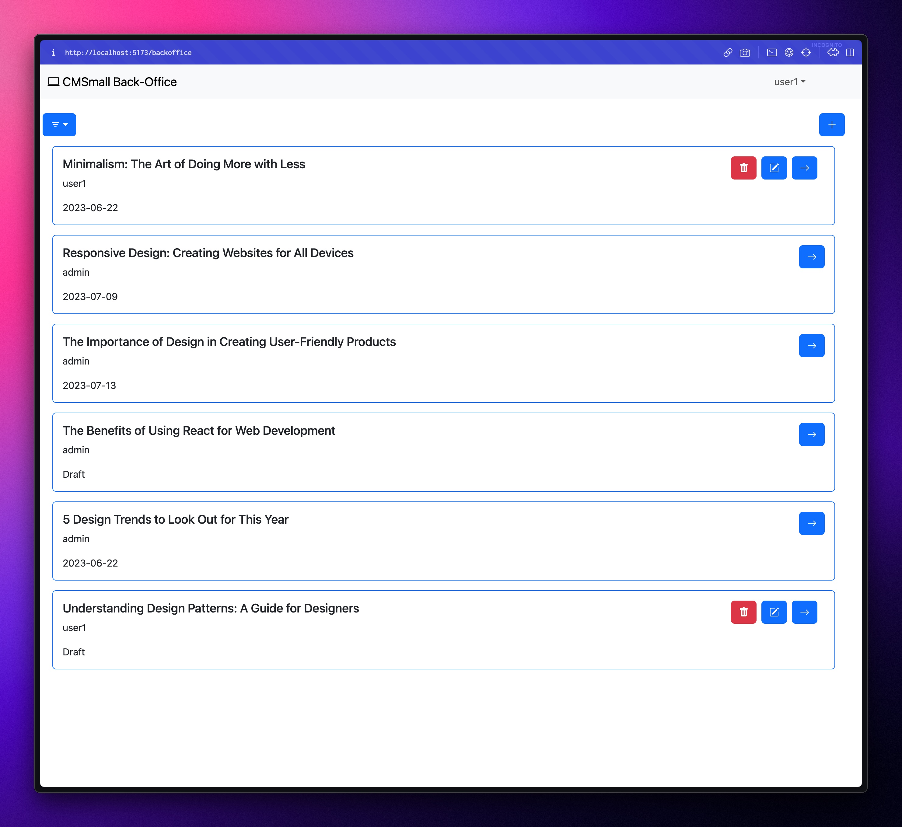
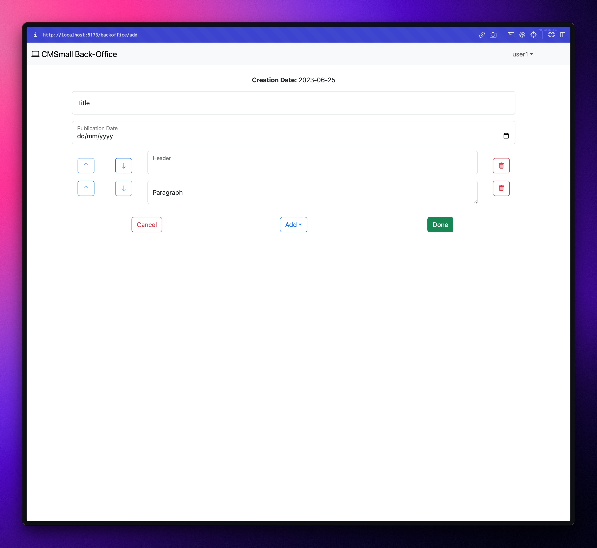

# CMSmall

## React Client Application Routes

- Route `/`: front-office pages list
- Route `/login`: login page
- Route `/:pageId`: front-office page detail, pageId is the page id contained in the database
- Route `/backoffice`: back-office pages list
- Route `/backoffice/:pageId`: back-office page detail with edit options, pageId is the page id contained in the database
- Route `/backoffice/add`: page creation route
- Route `/backoffice/:pageId/edit`: page edit route, pageId is the page id contained in the database
- Route `/backoffice/website-name`: website name edit route
- Route `*`: 404 page

## API Server

### User APIs

- POST `/api/sessions`

  - Request parameters: none
  - Request body:
    ```
    {
      "username": "a1@polito.it",
      "password": "password"
    }
    ```
  - Response body:
    ```
    {
      "id": 1,
      "usernamename": "admin",
      "name": "a1@polito.it",
      "role": "Admin"
    }
    ```

- GET `/api/sessions/current`

  - Request parameters: none
  - Request body: none
  - Response body:
    ```
    {
      "id": 1,
      "usernamename": "admin",
      "name": "a1@polito.it",
      "role": "Admin"
    }
    ```

- DELETE `/api/sessions/current`

  - Request parameters: none
  - Request body: none
  - Response body: none

---

### Pages APIs

- GET `/api/pages`

  - Request parameters: none
  - Request body: none
  - Response body:
    ```
    [
      {
        "id": 1,
        "title": "About",
        "author": "admin",
        "creationDate": "2021-03-21",
        "publicationDate": "2021-03-21",
        "content": [
          {
            "type": "Header",
            "body": "This is the content of the page"
          },
          {
            "type": "Image",
            "body": "Image_0"
          },
          {
            "type": "Paragraph",
            "body": "This is a paragraph created with the API"
          }
        ]
      },
      {
        "id": 2,
        "title": "About",
        "author": "admin",
        "creationDate": "2021-03-21",
        "publicationDate": "2021-03-21",
        "content": [
          {
            "type": "Header",
            "body": "This is the content of the page"
          },
          {
            "type": "Image",
            "body": "Image_0"
          },
          {
            "type": "Paragraph",
            "body": "This is a paragraph created with the API"
          }
        ]
      }
    ]
    ```

- GET `api/pages/published`

  - Request parameters: none
  - Request body: none
  - Response body:

  ```
    [
      {
        "id": 1,
        "title": "About",
        "author": "admin",
        "creationDate": "2021-03-21",
        "publicationDate": "2021-03-21",
        "content": [
          {
            "type": "Header",
            "body": "This is the content of the page"
          },
          {
            "type": "Image",
            "body": "Image_0"
          },
          {
            "type": "Paragraph",
            "body": "This is a paragraph created with the API"
          }
        ]
      },
      {
        "id": 2,
        "title": "About",
        "author": "admin",
        "creationDate": "2021-03-21",
        "publicationDate": "2021-03-21",
        "content": [
          {
            "type": "Header",
            "body": "This is the content of the page"
          },
          {
            "type": "Image",
            "body": "Image_0"
          },
          {
            "type": "Paragraph",
            "body": "This is a paragraph created with the API"
          }
        ]
      }
    ]
  ```

- GET `api/pages/scheduled`

  - Request parameters: none
  - Request body: none
  - Response body:

  ```
    [
      {
        "id": 1,
        "title": "About",
        "author": "admin",
        "creationDate": "2021-03-21",
        "publicationDate": "2024-03-21",
        "content": [
          {
            "type": "Header",
            "body": "This is the content of the page"
          },
          {
            "type": "Image",
            "body": "Image_0"
          },
          {
            "type": "Paragraph",
            "body": "This is a paragraph created with the API"
          }
        ]
      },
      {
        "id": 2,
        "title": "About",
        "author": "admin",
        "creationDate": "2021-03-21",
        "publicationDate": "2024-03-21",
        "content": [
          {
            "type": "Header",
            "body": "This is the content of the page"
          },
          {
            "type": "Image",
            "body": "Image_0"
          },
          {
            "type": "Paragraph",
            "body": "This is a paragraph created with the API"
          }
        ]
      }
    ]
  ```

- GET `api/pages/drafts`

  - Request parameters: none
  - Request body: none
  - Response body:

  ```
    [
      {
        "id": 1,
        "title": "About",
        "author": "admin",
        "creationDate": "2021-03-21",
        "publicationDate": null,
        "content": [
          {
            "type": "Header",
            "body": "This is the content of the page"
          },
          {
            "type": "Image",
            "body": "Image_0"
          },
          {
            "type": "Paragraph",
            "body": "This is a paragraph created with the API"
          }
        ]
      },
      {
        "id": 2,
        "title": "About",
        "author": "admin",
        "creationDate": "2021-03-21",
        "publicationDate": null,
        "content": [
          {
            "type": "Header",
            "body": "This is the content of the page"
          },
          {
            "type": "Image",
            "body": "Image_0"
          },
          {
            "type": "Paragraph",
            "body": "This is a paragraph created with the API"
          }
        ]
      }
    ]
  ```

- GET `/api/pages/:id`

  - Request parameters:
    ```
    {
      "id": 1
    }
    ```
  - Request body: none
  - Response body:
    ```
    {
        "id": 1,
        "title": "About",
        "author": "admin",
        "creationDate": "2021-03-21",
        "publicationDate": "2021-03-21",
        "content": [
          {
            "type": "Header",
            "body": "This is the content of the page"
          },
          {
            "type": "Image",
            "body": "Image_0"
          },
          {
            "type": "Paragraph",
            "body": "This is a paragraph created with the API"
          }
        ]
      }
    ```

- POST `/api/pages`

  - Request parameters: none
  - Request body:
    ```
    {
      "title": "This is a new page (created with the API)",
      "author": "admin",
      "publication_date": "2023-06-17"
      "content": [
        {
          "type": "Header",
          "body": "This is the content of the page"
        },
        {
          "type": "Image",
          "body": "Image_0"
        },
        {
          "type": "Paragraph",
          "body": "This is a paragraph created with the API"
        }
      ]
    }
    ```
  - Response body:
    ```
    {
      "message": "Page created"
    }
    ```

- PUT `/api/pages/:id`

  - Request parameters:
    ```
    {
      "id": 1
    }
    ```
  - Request body:
    ```
    {
    "title": "This is a new page (created with the API)",
    "author": "admin",
    "publication_date": "2023-06-17"
    "content": [
        {
          "type": "Header",
          "body": "This is the content of the page"
        },
        {
          "type": "Image",
          "body": "Image_0"
        },
        {
          "type": "Paragraph",
          "body": "This is a paragraph created with the API"
        }
      ]
    }
    ```
  - Response body:
    ```
    {
      "message": "Page updated"
    }
    ```

- DELETE `/api/pages/:id`

  - Request parameters:
    ```
    {
      "id": 1
    }
    ```
  - Request body: none
  - Response body: none

---

### Website APIs

- GET `/api/website`
  - Request parameters: none
  - Request body: none
  - Response body:
    ```
    {
      "name": "CMSmall"
    }
    ```
- PUT `/api/website`
  - Request parameters: none
  - Request body:
    ```
    {
      "name": "My Website"
    }
    ```
  - Response body: none

## Database Tables

- Table `users` - contains id, name, email, hashed password, salt and role of all registered users
- Table `pages` - contains id, title, author, creation date, publication date and content of all pages
- Table 'website' - contains id and website name

## Main React Components

- `LoginForm` (in `Auth.jsx`): renders the login form
- `LogoutButton` (in `Auth.jsx`): renders the logout button and handles its click event
- `LoginButton` (in `Auth.jsx`): renders the login button and handles its click event
- `WebsiteNameForm` (in `WebsiteName.jsx`): renders the form to change the website name and handles its submit event
- `PagesList` (in `PagesList.jsx`): renders the list of pages and depending on the user role and name, it renders the edit and delete buttons
- `NavigationBar` (in `Navigation.jsx`): renders the navigation bar displaying the website name, the user name, the back-office link and the login/logout button
- `PageForm` (in `PageForm.jsx`): renders the form to create or edit a page and handles its submit event
- `PageView` (in `PageForm.jsx`): renders the page content in view mode and depending on the route and the user role and name, it renders the edit and delete buttons

## Screenshot




## Users Credentials

- username: a1@polito.it, password: password, name: admin, role: Admin
- username: u1@polito.it, password: password, name: user1, role: Regular
- username: u2@polito.it, password: password, name: user2, role: Regular
- username: u3@polito.it, password: password, name: user3, role: Regular
